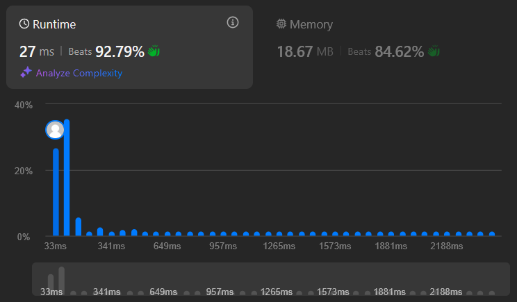

+++
title = "Leetcode #2521: Distinct Prime Factors of Product of Array"
date = "2026-01-04"
+++

A fun Leetcode problem I solved recently was [#2521](https://leetcode.com/problems/distinct-prime-factors-of-product-of-array/). In this blog post I'll discuss a couple of solutions to it.

## Problem statement

The problem statement simply asks us to find the number of **distinct prime factors** in the product of the elements of an array of positive integers. So for example the product of the elements of the array `[1, 2, 6, 7]` is `84`, whose prime factors are `[2, 2, 3, 7]`, which has `3` _distinct_ elements, so our answer should be `3`.

The array can have at most {{ katex(body="10,000") }} elements and each element lies between {{ katex(body="2") }} and {{ katex(body="1000") }}, both inclusive.

## A first attempt

A useful observation here is that we don't even need to multiply together all the array elements. We're only trying to count the **distinct prime factors** of the product, so if we build up a set of prime factors for each element and union all of them together and find its size, we'd be done. This way we sidestep issues with loss of precision or numeric type overflows.

We could of course get around the latter restriction by using a language like Python or a language library that supports arbitrary-precision integers, but that seems like overkill when we already have the simpler idea discussed above.

How do we find the prime factors of each element of the array? My first thought was to build up a list of primes from `2` to `1000`, since that's the range the array elements lie in. Then we could check each number against the list of primes, like so:

```python,linenos
class Solution:
    def distinctPrimeFactors(self, nums: List[int]) -> int:
        def is_prime(n):
            return not any(n % i == 0 for i in range(2, n))
        PRIMES = [k for k in range(2, 1001) if is_prime(k)]
        seen = set()
        for num in nums:
            for prime in PRIMES:
                if prime > num:
                    break
                if prime not in seen:
                    if num % prime == 0:
                        seen.add(prime)
        return len(seen)
```

In this code:

* To construct the list of primes we use a naive algorithm that simply marks a number `k` as prime if it has no integer factors in the set {{ katex(body="\{2, 3, 4, ..., k-1\}") }}. There are faster, more sophisticated algorithms to check primality, but this is just a first attempt. 

* The `if prime > num: break` clause on lines 11 and 12 lets us skip pointless checks for `num % prime == 0`, which can never be true if `prime` is greater than `num`.

This solution passes all testcases, but the runtime looks to be suboptimal.

<figure>

<figcaption>A first attempt at solving Leetcode #2521. The runtime only beats 21% of submissions.</figcaption>
</figure>

Let's analyze the runtime. I'm going to assume that the `%` (modulo) operation is constant time to simplify calculations.

1. Let's use {{ katex(body="N" )}} to denote the upper bound of each positive integer in the array (in our problem statement, this is {{ katex(body="1000" )}}. Let's also use {{ katex(body="M" )}} to denote the number of elements in our array.

1. We perform {{ katex(body="\Theta(N^2)" )}} operations to compute the list of all primes up to {{ katex(body="N" )}}, because for each number {{ katex(body="2 \le n \le N" )}} we check if it's prime by iterating from {{ katex(body="2 \le i \le n" )}}.

1. Then, for each number in the array we perform at most {{ katex(body="P" )}} checks, where {{ katex(body="P" )}} is the number of primes between {{ katex(body="1" )}} and {{ katex(body="1000" )}}.

Our total runtime is then {{ katex(body="\Theta(N^2) + O(MP)" )}}. Can we get an asymptotically faster runtime?

## Doing better

### The sieve of Eratosthenes

There isn't much to refine in the approach we used for our first attempt. We'll need to try a different approach.

When dealing with prime numbers it's natural to think of the [Sieve of Eratosthenes](https://en.wikipedia.org/wiki/Sieve_of_Eratosthenes#Overview). This is an algorithm to generate all prime numbers up to a given number, in this case {{ katex(body="1000") }}. The simplest implementation of this algorithm looks like [this in pseudocode](https://en.wikipedia.org/wiki/Sieve_of_Eratosthenes#Pseudocode).

Translating this to Python, we'd have something like

```python,linenos
isPrime = [True for _ in range(N+1)]
for i in range(2, N):
    if isPrime[i]:
        for j in range(2*i, N+1, i):
            isPrime[j] = False
```


It turns out we can extend the sieve in a clever way — we can store the smallest prime factor for each number instead of a simple boolean value. I read about this approach in [this GeeksForGeeks post](https://www.geeksforgeeks.org/dsa/prime-factor/).

```python,linenos
N = 1000  # Upper bound on primes to generate, as per the problem statement
smallestPrimeFactor = [i for i in range(N+1)]
for i in range(2, N):
    if smallestPrimeFactor[i] == i:  # prime!
        for j in range(2*i, N+1, i):
            if smallestPrimeFactor[j] == j:
                smallestPrimeFactor[j] = i
```

Compare this code to the previous code and notice the extra `if` condition on line 6. Why do we need it? `smallestPrimeFactor[j] != j` means that in previous iteration, a smaller value of `i` overwrote that particular value of `j`. And if that was the case, then we don't want to overwrite that value with this current, larger value of `i`.

Fair enough. But why store the smallest prime factor for each number at all? Because it gives us a quick way to factorize any number lying between {{ katex(body="1" )}} and {{ katex(body="N" )}}:

```python,linenos
# Returns the prime factorization of `num` in sorted ascending order.
def factorize(num: int, smallestPrimeFactor: list[int]) -> list[int]:
    prime_factors = []
    while num > 1:
        prime = smallestPrimeFactor[num]
        prime_factors.append(prime)
        num //= prime
    return prime_factors
```

It's straightforward to extend this function to instead dump all prime factors for a given number into a set external to the function. When we're done calling this function for every number in the array, we will have a set consisting of all of the distinct prime factors of the product of the entire array!

```python,linenos
distinctPrimes = set()
def factorizeAndUpdateDistinctSet(num: int, smallestPrimeFactor: list[int], distinctPrimes: set[int]):
    while num > 1:
        prime = smallestPrimeFactor[num]
        distinctPrimes.add(prime)
        num //= prime
```

And putting it all together, we have a working solution:

```python,linenos
N = 1000
smallestPrimeFactor = [i for i in range(N+1)]
for i in range(2, N+1):
    if smallestPrimeFactor[i] == i:  # prime!
        for j in range(2*i, N+1, i):
            if smallestPrimeFactor[j] == j:
                smallestPrimeFactor[j] = i

distinctPrimes = set()
def factorizeAndUpdateDistinctSet(num, smallestPrimeFactor, distinctPrimes):
    while num > 1:
        prime = smallestPrimeFactor[num]
        distinctPrimes.add(prime)
        num //= prime

for num in nums:
    factorizeAndUpdateDistinctSet(num, smallestPrimeFactor, distinctPrimes)
return len(distinctPrimes)
```

...and it's much faster than before!

<figure>

<figcaption>Our runtime now beats 92% of all submissions.</figcaption>
</figure>

Let's analyze the runtime for this algorithm. Again, I'm going to assume that integer division (`//`) is constant time to simplify calculations. Again, not true, but interestingly, integer division is about as fast as the modulo operation is, so we're making the "same" deliberate error when comparing these two algorithms.

1. In the phase where we compute the smallest prime factor for each number, we update each element of the `smallestPrimeFactor` array at most once. So that's {{ katex(body="\Theta(N)") }}, because that's how many elements the array has.

1. Next, we factorize each member of the array, spending {{ katex(body="O(Q)") }} time on each, where {{ katex(body="Q") }} is the _maximum_ number of not-necessarily-distinct prime factors that any element of the array has. It would be nice if we could get a not-too-coarse upper bound on {{ katex(body="Q" )}}, to keep things simple. As it happens, we can! To get as a high value as possible for the number of not-necessarily-distinct prime factors of a number, we can just keep multiplying by the smallest prime number there is, {{ katex(body="2" )}}. Notice how {{ katex(body="512 = 2^9") }} has 9 not-necessarily-distinct prime factors, and so we can confidently say that no number under {{ katex(body="1000" )}} has more than 10 not-necessarily-distinct prime factors.

1. In general, a nice not-too-coarse upper bound for {{ katex(body="Q") }} would be {{ katex(body="\log_{2}(N)") }} And so our running time for the factorization phase is {{ katex(body="\Theta(N\log_{2}(N))") }}.

So our total runtime for this algorithm is {{ katex(body="\Theta\log_2{N}") }}. Much better than our earlier runtime!

### Optimization: skipping a few iterations

Every time we encounter a prime number, we "cross out" (set the corresponding index in `smallestPrimeFactor`) all of its multiples. To do so we'd move the index {{ katex(body="j" )}} from {{ katex(body="2i" )}} all the way up to {{ katex(body="N+1" )}} (upper bound exclusive) by steps of {{ katex(body="i" )}}, where {{ katex(body="N" )}} is the upper bound on primes that we want to generate.

But there's a nice optimization available to us. Consider a prime number {{ katex(body="i" )}}. By the time our iteration variable {{ katex(body="j" )}} reaches {{ katex(body="i" )}}, we have already processed _every_ multiple of _every_ prime that was smaller than {{ katex(body="i" )}}. For example:

* we had already processed every multiple of {{ katex(body="2" )}}, including {{ katex(body="2i" )}}
* we had already processed every multiple of {{ katex(body="3" )}}, including {{ katex(body="3i" )}}
* ...and so on

To be precise, by the time {{ katex(body="j" )}} reaches {{ katex(body="i" )}}, we have already processed every multiple of {{ katex(body="i" )}} smaller than {{ katex(body="i \times i" )}}. We know for a fact that we haven't already processed {{ katex(body="i \times i" )}} itself, because {{ katex(body="i" )}} is prime and therefore would not be part of any of the previous iterations.

And so we can start our iteration from {{ katex(body="i^2" )}} instead of {{ katex(body="2i" )}}, skipping a few `if` checks that would always have failed (because `smallestPrimeFactor[i]` would've been set to something other than `i` by that point).

```python,linenos
N = 1000  # as per the problem statement
smallestPrimeFactor = [i for i in range(N+1)]
for i in range(2, N):
    if smallestPrimeFactor[i] == i:  # prime!
        for j in range(i*i, N+1, i):
            if smallestPrimeFactor[j] == j:
                smallestPrimeFactor[j] = i
```

### Closing thoughts

* Notice how we use linear space in the sieve method: we allocate memory upfront for every number from {{ katex(body="0" )}} to {{ katex(body="N" )}} to store each number's smallest prime factor. This works well enough when our input is quite bounded as in the problem statement, with a maximum value of only {{ katex(body="1000" )}}.

* In both the naive approach and the sieve approach, we perform some precomputation. In the first method, we precomputed all primes up to {{ katex(body="1000" )}}. In the second method, we precomputed the smallest prime factor for every number up to {{ katex(body="1000" )}}. Logic like this should ideally live in the constructor (`def __init__(self):`) so that we do it only once and then reuse the solver object to answer queries for several inputs.